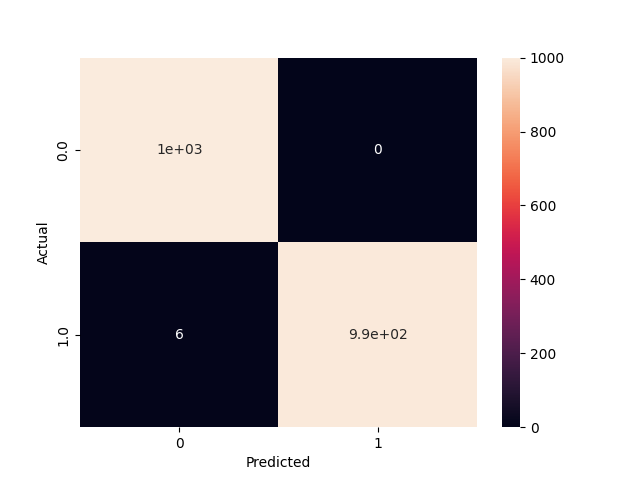

# Sentiment Analysis for text with Logistic Regression 💻😀☹️

Implemented a Logistic Regression algorithm to classify text data (e.g. tweets and posts) based on sentiment analysis (positive or negative) <br>
The dataset used is taken from ```from nltk.corpus import twitter_samples``` 

<hr>

### HOW
🧑‍💻 Python

<hr>

### USAGE
### `python main.py`
Runs the main script

<hr>

### EXAMPLEs
- ```"Today is beautiful day!! :)"``` prediction -> 1 (positive)
- ```"I am hopeless for the next week :("``` prediction -> 0 (negative)
- ```"That decision was a shame!"``` prediction -> 0 (negative)
    
<hr>

### Confusion Matrix
**Accuracy : 99.7%** <br>
**Total False Positive/Negative Rate : 0.3%** <br>
Here is the confusion matrix used to define thethe performance of the classification algorithm <br>

